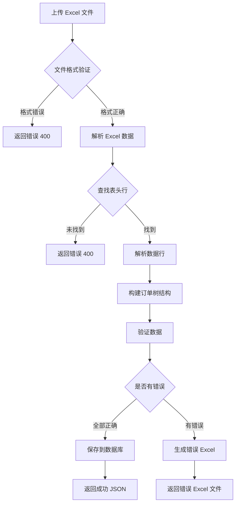

# 订单导入 API 文档

## 接口概述
批量导入订单数据,支持 Excel 文件上传。导入失败时返回包含错误信息的 Excel 文件。

---

## 基本信息

- **接口地址**: `POST /api/orders/import`
- **认证方式**: JWT Token (Bearer Token)
- **权限要求**: `OrderManagement`
- **请求类型**: `multipart/form-data`
- **返回类型**: JSON / Excel 文件

---

## 请求参数

### Headers
| 参数名 | 类型 | 必填 | 说明 |
|--------|------|------|------|
| Authorization | String | 是 | JWT Token，格式: `Bearer <token>` |
| Content-Type | String | 是 | 固定值: `multipart/form-data` |

### Body (Form Data)
| 参数名 | 类型 | 必填 | 说明 |
|--------|------|------|------|
| file | File | 是 | Excel 文件 (.xlsx 或 .xls) |

---

## Excel 文件格式要求

### 表头行（必须包含以下列，顺序可变）
| 列名 | 必填 | 说明 | 示例 |
|------|------|------|------|
| 序号 | 否 | 订单序号 | 1 |
| 订单号 | 是 | 订单编号（唯一） | DA25214A |
| 机型 | 是 | 机器型号 | PN1.5X |
| 料号 | 是 | 订单料号 | 908010400.008 |
| 序列号 | 是 | 序列号范围，格式: 起始--结束 | PN15700001--PN15700720 |
| 组件名称 | 是 | 组件名称 | 母板组件 |
| 组件料号 | 是 | 组件料号 | 808010400.001 |
| 名称 / 子组件名称 / 子件名称 | 是 | 子组件名称（三种名称均可识别） | 母板 |
| 料号 / 子组件料号 / 子件料号 | 是 | 子组件料号（三种名称均可识别） | 708010400.001 |
| 规格型号 / 规格 | 否 | 子组件规格型号 | PCB版本V0.2，DSP平台 |
| 软件名称 | 是 | 软件名称 | USB驱动 |
| 软件版本号 / 版本号 | 否 | 软件版本 | SET_V1.10_2024108 |

### 数据格式说明

1. **层次结构**: 订单 → 组件 → 子组件 → 软件
2. **合并单元格**: 支持使用合并单元格表示层次关系
3. **表头位置**: 支持自动检测表头位置（前20行内）
4. **空行**: 自动跳过空行
5. **序列号格式**: 
   - 支持 `--` 分隔: `PN15700001--PN15700720`
   - 支持换行分隔: 
     ```
     PN15700001
     PN15700720
     ```
6. **科学计数法**: 自动处理科学计数法料号（如 `7.03011E+11` → `703010800142`）

### 数据验证规则

| 字段 | 验证规则 | 错误提示 |
|------|---------|---------|
| 订单号 | 不能为空 | 订单号不能为空 |
| 机型 | 不能为空 | 机型不能为空 |
| 料号 | 不能为空 | 料号不能为空 |
| 序列号起始 | 不能为空 | 序列号起始不能为空 |
| 序列号结束 | 不能为空 | 序列号结束不能为空 |
| 组件名称 | 不能为空 | 组件名称不能为空 |
| 组件料号 | 不能为空 | 组件料号不能为空（组件：xxx） |
| 子组件名称 | 不能为空 | 子组件名称不能为空（组件：xxx） |
| 子组件料号 | 不能为空 | 子组件料号不能为空（子组件：xxx） |
| 软件名称 | 不能为空 | 软件名称不能为空（子组件：xxx） |
| 组件 | 至少一个 | 订单必须包含至少一个组件 |
| 子组件 | 至少一个 | 组件必须包含至少一个子组件（组件：xxx） |
| 软件 | 至少一个 | 子组件必须包含至少一个软件（子组件：xxx） |

---

## 请求示例

### JavaScript (Axios)
```javascript
const importOrders = async (file) => {
  const formData = new FormData();
  formData.append('file', file);
  
  try {
    const response = await axios.post('/api/orders/import', formData, {
      headers: {
        'Authorization': `Bearer ${localStorage.getItem('token')}`,
        'Content-Type': 'multipart/form-data'
      },
      responseType: 'blob'  // 重要：因为可能返回 Excel 或 JSON
    });
    
    // 检查响应类型
    const contentType = response.headers['content-type'];
    
    if (contentType.includes('application/json')) {
      // 全部导入成功
      const text = await response.data.text();
      const result = JSON.parse(text);
      alert(`导入成功！共导入 ${result.success_count} 条订单`);
      
    } else if (contentType.includes('spreadsheet')) {
      // 有错误，下载错误 Excel
      const blob = new Blob([response.data]);
      const url = window.URL.createObjectURL(blob);
      const link = document.createElement('a');
      link.href = url;
      
      // 从响应头获取文件名
      const contentDisposition = response.headers['content-disposition'];
      const filename = contentDisposition 
        ? contentDisposition.split('filename=')[1].replace(/"/g, '')
        : `order_import_errors_${Date.now()}.xlsx`;
      
      link.setAttribute('download', filename);
      document.body.appendChild(link);
      link.click();
      link.remove();
      window.URL.revokeObjectURL(url);
      
      alert('导入失败！请下载错误文件，修改后重新导入');
    }
    
  } catch (error) {
    if (error.response && error.response.data) {
      // 尝试解析错误信息
      const text = await error.response.data.text();
      const errorData = JSON.parse(text);
      alert(`导入失败：${errorData.error || errorData.message}`);
    } else {
      alert('导入失败，请重试');
    }
    console.error('导入失败:', error);
  }
};

// 使用示例（配合文件上传控件）
// <input type="file" id="fileInput" accept=".xlsx,.xls" />
document.getElementById('fileInput').addEventListener('change', (e) => {
  const file = e.target.files[0];
  if (file) {
    importOrders(file);
  }
});
```

### Fetch API
```javascript
const importOrders = async (file) => {
  const formData = new FormData();
  formData.append('file', file);
  
  const response = await fetch('/api/orders/import', {
    method: 'POST',
    headers: {
      'Authorization': `Bearer ${localStorage.getItem('token')}`
      // 注意：使用 FormData 时不要手动设置 Content-Type
    },
    body: formData
  });
  
  const contentType = response.headers.get('content-type');
  
  if (contentType.includes('application/json')) {
    const result = await response.json();
    console.log('导入成功:', result);
  } else {
    const blob = await response.blob();
    // 下载错误文件
    const url = window.URL.createObjectURL(blob);
    const a = document.createElement('a');
    a.href = url;
    a.download = `order_import_errors_${Date.now()}.xlsx`;
    a.click();
    window.URL.revokeObjectURL(url);
  }
};
```

### cURL
```bash
curl -X POST "http://localhost:5000/api/orders/import" \
  -H "Authorization: Bearer YOUR_JWT_TOKEN" \
  -F "file=@/path/to/orders.xlsx"
```

---

## 响应

### 成功响应（全部导入成功）

**HTTP 状态码**: 200

**Content-Type**: `application/json`

```json
{
  "message": "导入成功",
  "success_count": 15
}
```

| 字段 | 类型 | 说明 |
|------|------|------|
| message | String | 成功提示信息 |
| success_count | Integer | 成功导入的订单数量 |

---

### 部分成功响应（有错误数据）

**HTTP 状态码**: 200

**Content-Type**: `application/vnd.openxmlformats-officedocument.spreadsheetml.sheet`

**Content-Disposition**: `attachment; filename="order_import_errors_20251215_143022.xlsx"`

**响应体**: Excel 文件（包含错误信息）

#### 错误 Excel 格式
与导入文件格式相同，额外增加一列：

| 列名 | 说明 |
|------|------|
| ... | 原始数据列 |
| 错误原因 | 详细的错误信息（红色背景标注） |

**错误信息示例**:
```
订单号不能为空; 机型不能为空
组件料号不能为空（组件：母板组件）
子组件料号不能为空（子组件：母板）; 子组件必须包含至少一个软件（子组件：母板）
```

**Excel 特性**:
- ✅ 保留原始数据结构和合并单元格
- ✅ 错误原因列使用红色背景突出显示
- ✅ 多个错误用分号分隔
- ✅ 修改后可直接重新导入

---

### 失败响应

#### 1. 未上传文件 (HTTP 400)
```json
{
  "error": "请上传文件"
}
```

#### 2. 文件名为空 (HTTP 400)
```json
{
  "error": "文件名不能为空"
}
```

#### 3. 文件格式错误 (HTTP 400)
```json
{
  "error": "请上传 Excel 文件（.xlsx 或 .xls）"
}
```

#### 4. 未授权 (HTTP 401)
```json
{
  "error": "Missing Authorization Header"
}
```

#### 5. 权限不足 (HTTP 403)
```json
{
  "error": "权限不足"
}
```

#### 6. 表头格式错误 (HTTP 400)
```json
{
  "error": "导入失败: 未找到有效的表头行，请确保 Excel 包含：序号、订单号、机型等列"
}
```

#### 7. 其他导入错误 (HTTP 400)
```json
{
  "error": "导入失败: 具体错误信息"
}
```

---

## 错误码说明

| HTTP 状态码 | 说明 | 解决方案 |
|------------|------|---------|
| 200 | 导入成功 或 返回错误 Excel | 查看响应类型 |
| 400 | 请求参数错误 | 检查文件格式和内容 |
| 401 | 未提供 Token 或 Token 无效 | 重新登录获取有效 Token |
| 403 | 用户无 OrderManagement 权限 | 联系管理员分配权限 |

---

## 下载导入模板

### 接口信息
- **接口地址**: `GET /api/orders/import/template`
- **认证方式**: JWT Token
- **权限要求**: 无特殊要求（已登录即可）
- **返回类型**: Excel 文件

### 请求示例
```javascript
const downloadTemplate = async () => {
  try {
    const response = await axios.get('/api/orders/import/template', {
      headers: {
        'Authorization': `Bearer ${localStorage.getItem('token')}`
      },
      responseType: 'blob'
    });
    
    const url = window.URL.createObjectURL(new Blob([response.data]));
    const link = document.createElement('a');
    link.href = url;
    link.setAttribute('download', 'order_import_template.xlsx');
    document.body.appendChild(link);
    link.click();
    link.remove();
    window.URL.revokeObjectURL(url);
    
  } catch (error) {
    console.error('下载模板失败:', error);
  }
};
```

### 响应
**HTTP 状态码**: 200

**Content-Type**: `application/vnd.openxmlformats-officedocument.spreadsheetml.sheet`

**Content-Disposition**: `attachment; filename="order_import_template.xlsx"`

**模板内容**: 包含示例数据的标准格式 Excel 文件

---

## 导入流程



---

## 注意事项

1. **文件大小限制**: 建议单次导入不超过 1000 条订单
2. **订单号唯一性**: 订单号必须全局唯一，重复会导致导入失败
3. **合并单元格**: 支持读取合并单元格，会自动获取主单元格的值
4. **表头灵活性**: 支持多种列名变体（如"名称"、"子组件名称"、"子件名称"）
5. **错误处理**: 
   - 有任何错误都会返回错误 Excel
   - 修改错误后可直接重新导入
   - 错误信息详细标注在每条错误数据的最后一列
6. **数据格式**: 
   - 序列号支持 `--` 或换行分隔
   - 料号自动处理科学计数法
   - 自动清理 BOM 和零宽字符
7. **层次结构**: 
   - 每个订单必须有组件
   - 每个组件必须有子组件
   - 每个子组件必须有软件

---

## 常见问题

### Q1: 导入时提示"未找到有效的表头行"？
**A**: 检查:
1. Excel 前 20 行内是否包含"订单号"和"机型"列
2. 列名是否正确（区分全角/半角）
3. 是否有多余的空格

### Q2: 部分订单导入成功，部分失败？
**A**: 
1. 下载返回的错误 Excel 文件
2. 查看"错误原因"列的详细信息
3. 修改错误数据后重新导入

### Q3: 合并单元格的数据读取不正确？
**A**: 确保:
1. 主单元格（左上角）有数据
2. 合并区域没有跨越不同的订单

### Q4: 如何批量导入大量订单？
**A**: 
1. 建议分批导入，每批 500-1000 条
2. 先下载模板了解格式
3. 可以使用系统导出的 Excel 作为参考

### Q5: 序列号格式不对怎么办？
**A**: 序列号支持两种格式:
1. `起始--结束` (双横线)
2. 换行分隔（起始号在第一行，结束号在第二行）

### Q6: 导入后如何验证数据？
**A**: 
1. 使用导出功能导出刚导入的订单
2. 对比原始文件和导出文件
3. 或通过列表接口查询验证

---

## 最佳实践

1. **导入前准备**:
   - 先下载模板，了解标准格式
   - 检查数据完整性和格式
   - 确保订单号不重复

2. **数据整理**:
   - 使用 Excel 的数据验证功能预检查
   - 统一使用标准列名
   - 删除多余的空行和空列

3. **错误处理**:
   - 下载错误 Excel 后逐条检查
   - 修改完成后整体重新导入
   - 不要只修改错误的行

4. **大批量导入**:
   - 分批导入，便于排查问题
   - 保留原始文件备份
   - 导入后及时验证

---

## 更新日志

| 版本 | 日期 | 说明 |
|------|------|------|
| 1.0 | 2025-12-15 | 初始版本，支持订单批量导入 |

---

## 联系方式

如有问题，请联系技术支持。
